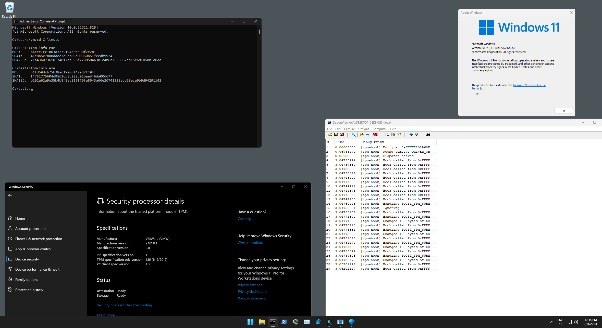

# TPM Spoofer
Modern anticheats have started to (ab)use [TPM (Trusted Platform Module)](https://en.wikipedia.org/wiki/Trusted_Platform_Module) to obtain yet another unique identifier that can be linked to a player's hardware. This project serves as a proof of concept aiming to demonstrate how to hook into the [Windows TPM stack](https://learn.microsoft.com/en-us/windows/security/hardware-security/tpm/how-windows-uses-the-tpm).

## HWID and TPM
Unfortunately, a common misconception exists that resetting the TPM is enough to prevent HWID bans. However, this is entirely incorrect. Each TPM has an **Endorsement Key (EK)**, which is embedded during manufacturing, is unique to each TPM, and most importantly, **cannot be changed or removed**. [Read more about that here](https://learn.microsoft.com/en-us/windows-server/identity/ad-ds/manage/component-updates/tpm-key-attestation).

## Possible flags
I wanted to keep this project as simple as possible, and as such, it uses the good ol' IOCTL dispatch swap. This is most likely the biggest detection vector, even without considering TPM, so **do not use this as is** ([hook WPP](https://github.com/btbd/wpp/) or [use hypervisor](https://github.com/tandasat/SimpleSvmHook)). For the TPM itself, all it does in its current state is overwrite every request to read any public key. As you can imagine, it is quite trivial to figure out that something is going on. It will suffice for anything that only blindly checks for the EK (which is what a few ACs do at the time of this project's release).

Also make sure to clean up the registry entiries created on boot: `HKEY_LOCAL_MACHINE\SYSTEM\CurrentControlSet\Services\TPM\WMI\Endorsement`.

## Usage
This repository contains two projects:
- `tpm-info` - Simple console application to read EK from the TPM under Windows
- `tpm-hook` - Kernel-mode driver that hooks tpm.sys dispatch to overwrite any command requests for public keys

Both of there projects were tested on Windows 11 22H2 22621. You will need [Visual Studio 2022](https://visualstudio.microsoft.com/) and [WDK](https://learn.microsoft.com/en-us/windows-hardware/drivers/download-the-wdk) to compile them. You can also [download the compiled binaries in the releases section](https://github.com/SamuelTulach/tpm-spoofer/releases).

## Demo

